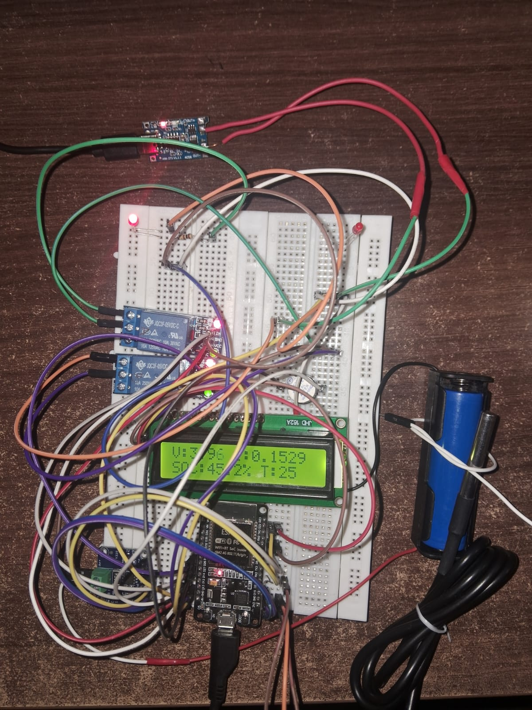

# 🔋 Battery Management System (BMS) for SoC Estimation

## 📌 Overview

This project presents a **Battery Management System (BMS)** designed to estimate the **State of Charge (SoC)** of a Lithium-ion battery using an ESP32.

The system uses a hybrid approach:

* Coulomb Counting (for continuous tracking)
* Open Circuit Voltage (OCV) (for correction)

This balances **accuracy, simplicity, and low computational cost**.

---

## ⚙️ Features

* 📊 Real-time monitoring:

  * Voltage
  * Current
  * Temperature
* 🔋 SoC estimation (Coulomb Counting + OCV)
* ⚡ Dual relay protection (load + charger cutoff)
* 📺 LCD display output
* 🔔 Buzzer alerts
* 📡 Serial monitoring via ESP32

---

## 🧠 Core Concept

Instead of complex estimation algorithms, this system relies on:

* **Coulomb Counting**
  → Tracks battery charge over time

* **OCV Correction**
  → Reduces drift when battery is idle

---

## 🛠️ Hardware Components

* ESP32
* INA219 Current Sensor
* DS18B20 Temperature Sensor
* Relay Module
* 16x2 LCD
* Lithium-ion Battery

---

## 🔌 System Workflow

1. Sensors collect voltage, current, and temperature
2. ESP32 processes the data
3. SoC is estimated using Coulomb Counting
4. OCV corrects SoC when current is near zero
5. Safety conditions are checked
6. Relays disconnect load/charger if unsafe
7. Data is displayed and logged

---

## 🚨 Safety Features

* Over-temperature protection
* Over-voltage protection
* Under-voltage protection
* Audible alerts

---

## 📊 Results Summary

* Voltage error < 40 mV
* Stable current measurement
* Reliable SoC estimation with correction
* Fast relay response during faults

---

## 📚 Documentation

* 📖 [Introduction](docs/Introduction.md)
* ⚙️ [Methodology](docs/Methodology.md)
* 📊 [Results](docs/Results.md)
* 🔌 [Hardware Connections](hardware/Connections.md)

---

## 📂 Project Structure

```plaintext
battery-management-system/
│── README.md
│── code/
│   └── bms_code.ino
│── docs/
│   ├── Introduction.md
│   ├── Methodology.md
│   ├── Results.md
│── hardware/
│   └── Connections.md
│── images/
│   └── bms_img.jpeg
```

---

## 🚀 How to Run

### 1️⃣ Upload Code

* Open Arduino IDE
* Select ESP32 board
* Upload:

  ```
  code/bms_code.ino
  ```

### 2️⃣ Setup Hardware

Follow:
👉 [Hardware Connections](hardware/Connections.md)

### 3️⃣ Power System

* Connect battery
* Power ESP32

### 4️⃣ Monitor Output

* LCD Display
* Serial Monitor (115200 baud)

---

## 📸 System Preview



---

## ⚠️ Limitations

* No multi-cell balancing
* No battery health estimation
* Fixed threshold-based protection

---

## 🚀 Future Improvements

* Multi-cell battery support
* Wireless monitoring (mobile app)
* MOSFET-based switching
* Advanced SoC algorithms

---

## 📜 License

For educational and research purposes.

